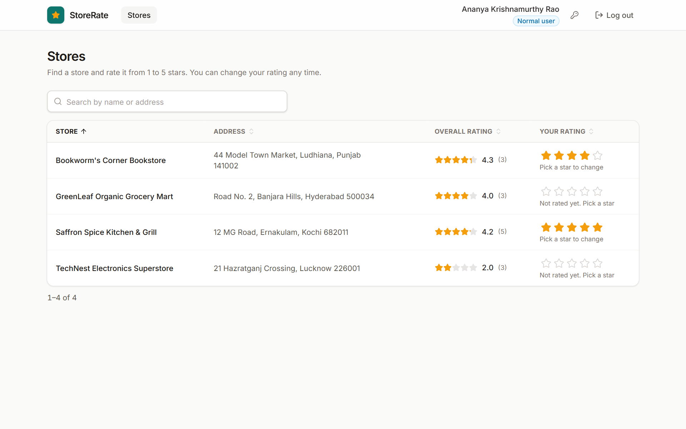
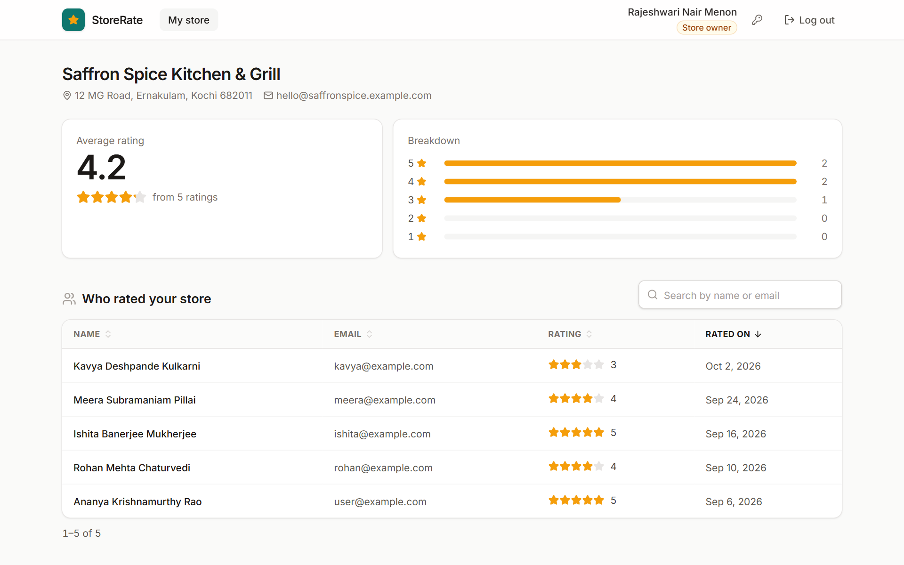
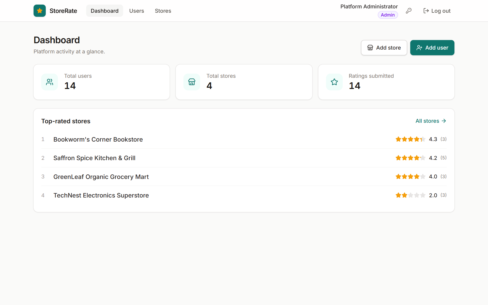
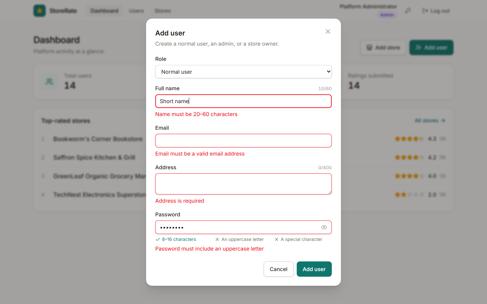
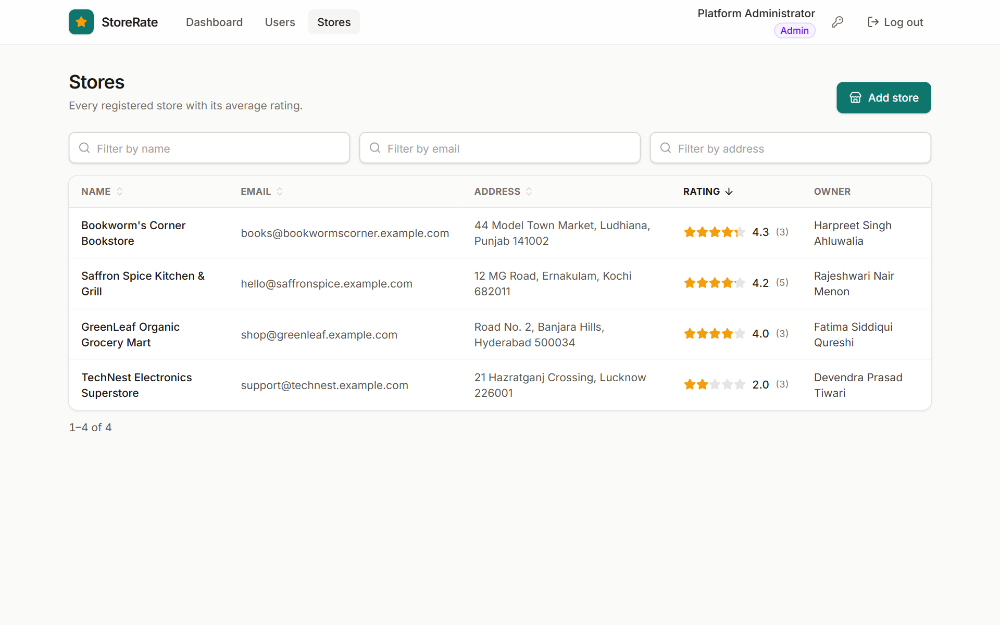
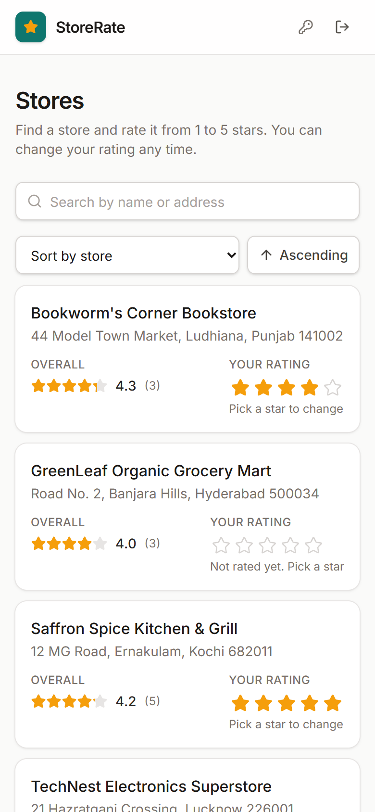
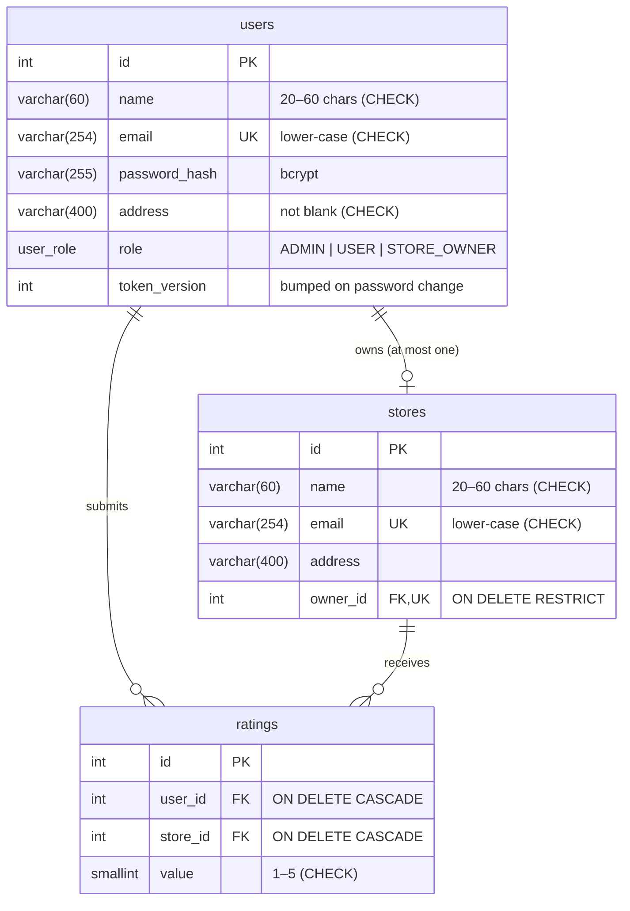

# StoreRate

[](https://github.com/suyash503/roxiler-store-ratings/actions/workflows/ci.yml)

A web app where users rate stores from 1 to 5. Three roles share one login: **admins** manage users and stores, **normal users** find and rate stores, and **store owners** see how their store is rated.

Built for the Roxiler Systems FullStack Intern Coding Challenge with **NestJS 11 · PostgreSQL · Prisma 7 · React 19**.

| Normal user | Store owner |
|---|---|
|  |  |
| **Admin dashboard** | **Admin: add user, validated as you type** |
|  |  |
| **Admin: stores, sorted by rating** | **On a phone** |
|  |  |

## Run it

### With Docker (one command)

```bash
docker compose up --build
```

Open **http://localhost:8080**. Compose starts PostgreSQL, applies the migrations, loads the demo data, then starts the API and the web app.

### Without Docker

Needs Node 22.12+ and PostgreSQL 14+.

```bash
npm install
cp backend/.env.example backend/.env    # set DATABASE_URL and JWT_SECRET
npm run db:migrate
npm run db:seed
npm run dev                              # web http://localhost:5180 · API http://localhost:4100/api
```

API docs (Swagger) are at **http://localhost:4100/api/docs**.

### Demo accounts

The login page has one-click buttons for these.

| Role | Email | Password |
|---|---|---|
| Admin | `admin@example.com` | `Admin@1234` |
| Store owner | `rajeshwari@example.com` | `Owner@1234` |
| Normal user | `user@example.com` | `User@1234` |

The seed also creates 4 more owners and 7 more users (same passwords per role; see [`backend/prisma/seed.ts`](backend/prisma/seed.ts)). One owner, `lakshmi@example.com`, has no store yet, so "Add store" has someone to assign.

## What each role can do

| Requirement | Where |
|---|---|
| One login for all roles, routed by role | `POST /api/auth/login` → admin `/admin`, user `/stores`, owner `/owner` |
| Normal users sign up (name, email, address, password) | `/signup` |
| Every role can change their password and log out | key icon and "Log out" in the header |
| **Admin:** totals of users, stores and ratings | `/admin` |
| **Admin:** add normal users, admins and store owners | "Add user" (any role) |
| **Admin:** add stores | "Add store", assigned to a store owner |
| **Admin:** list stores (name, email, address, rating) | `/admin/stores` |
| **Admin:** list users (name, email, address, role) | `/admin/users` |
| **Admin:** filter by name, email, address and role | filter boxes above each table |
| **Admin:** user details, plus the rating for store owners | click a user row |
| **User:** list and search stores by name and address | `/stores` |
| **User:** see overall rating and their own rating | columns on `/stores` |
| **User:** submit a 1–5 rating, then modify it | click a star; click again to change |
| **Owner:** who rated my store, and my average | `/owner` |
| Form rules (name, address, password, email) | enforced in the form, the API **and** the database |
| Every table sorts ascending/descending | click a column header (or the sort picker on phones) |

## How it's built

```
roxiler/
├── backend/                 NestJS API
│   ├── prisma/              schema, SQL migrations, demo seed
│   ├── src/
│   │   ├── auth/            login/signup/password, JWT cookie, AuthGuard + RolesGuard
│   │   ├── users/           admin: add/list/detail users
│   │   ├── stores/          store list (admin + user views), add store, rate a store
│   │   ├── owner/           store-owner dashboard
│   │   ├── stats/           admin totals
│   │   └── common/          form rules, list/paging DTOs, Prisma error mapping
│   └── test/                e2e tests against a real PostgreSQL
├── frontend/                React + Vite
│   └── src/
│       ├── auth/            session query, route guards
│       ├── components/      DataTable, StarRating, Modal, fields…
│       ├── pages/           admin/, user/, owner/, auth/
│       └── lib/             API client, zod rules (mirror the API), URL table state
├── docker-compose.yml
└── .github/workflows/ci.yml
```

**Backend.** Every route needs a session unless it's marked `@Public()`. A global `AuthGuard` verifies the JWT and loads the user from the database, so a role change takes effect immediately. A global `RolesGuard` then checks `@Roles(...)`. DTOs are validated with class-validator; unknown fields are rejected (a sign-up can't smuggle in `"role": "ADMIN"`).

**Frontend.** Server state lives in TanStack Query; forms use react-hook-form with zod schemas that mirror the API's rules and messages. Table sort, filters and page are kept in the URL, so a filtered view survives a refresh and the back button works. Ratings update optimistically and roll back if the API refuses.

## Database



- **The database enforces the rules too.** CHECK constraints cover the rating range, name length and lower-case emails, so a bad row can't get in through a script or a future bug. See [`migration.sql`](backend/prisma/migrations).
- **One rating per user per store** is a unique index on `(user_id, store_id)`. Submitting and modifying are the same `INSERT … ON CONFLICT DO UPDATE`, so a double-click can never create two rows.
- **One store per owner** is a unique index on `owner_id`.
- **Averages are computed, not stored.** There's no running total to drift out of sync. An index on `ratings(store_id)` serves both the averages and the owner's list. A store with no ratings shows "No ratings yet", not 0, and sorts last in both directions.
- **Emails are case-insensitive.** They're stored lower-cased, so `Priya@x.com` and `priya@x.com` can't both register.
- `snake_case` tables and columns, `timestamptz` timestamps, an enum for roles.

## API

All routes are under `/api`. Full request/response schemas: **`/api/docs`**.

| Method | Path | Who | What |
|---|---|---|---|
| POST | `/auth/signup` | anyone | create a normal user and log in |
| POST | `/auth/login` | anyone | log in (any role) |
| POST | `/auth/logout` | anyone | clear the session cookie |
| GET | `/auth/me` | logged in | current user |
| PATCH | `/auth/password` | logged in | change password |
| GET | `/stats` | admin | total users, stores, ratings |
| GET | `/users` | admin | list users: filter `name`, `email`, `address`, `role`; `sortBy`, `order`, `page`, `pageSize` |
| POST | `/users` | admin | add a user of any role |
| GET | `/users/:id` | admin | user details (owners include their store's rating) |
| GET | `/stores` | admin, user | list stores: `q` (name or address), `name`, `email`, `address`; sort by name, email, address, `averageRating`, `myRating`… |
| POST | `/stores` | admin | add a store for a store owner |
| PUT | `/stores/:id/rating` | user | submit or change a 1–5 rating |
| GET | `/owner/dashboard` | owner | average, count, star breakdown |
| GET | `/owner/ratings` | owner | who rated the store: search `q`, sort, page |

Errors use Nest's shape: `{ "statusCode": 400, "message": ["Name must be 20–60 characters", …], "error": "Bad Request" }`.

## Security

- **Session:** a JWT in an `httpOnly`, `SameSite=Lax` cookie, so page scripts can't read it. Lax keeps it off cross-site POSTs; with the CORS allow-list and JSON-only bodies, that's the CSRF defence. Set `COOKIE_SECURE=true` behind HTTPS.
- **Password change signs out other sessions.** It bumps `token_version`, which every JWT carries.
- **Passwords** are hashed with bcrypt. Login runs bcrypt even for unknown emails and returns one message for both cases, so it doesn't reveal which emails are registered.
- **Rate limiting:** 10 attempts a minute on login, sign-up and password change, plus a general limit. Behind a proxy, set `TRUST_PROXY` so limits apply per user, not per proxy.
- **Inputs:** validated and whitelisted. `%` and `_` in search boxes match literally. Sort columns come from a fixed list, so user input never reaches the SQL text.
- **Headers:** `helmet` sets the standard security headers.

## Tests

```bash
npm test -w backend    # 85 e2e + validation tests (needs PostgreSQL)
npm test -w frontend   # 42 component and form-rule tests
```

- **Backend (Jest + supertest)** runs the real app against a real PostgreSQL. It covers every role boundary, every form-rule edge (19/20/60/61-character names, 7/8/16/17-character passwords…), the DB constraints themselves, 10 simultaneous rating submits leaving exactly one row, and literal `%`/`_` search. It uses a separate database named `<your db>_test` and refuses to run against any other.
- **Frontend (Vitest + Testing Library)** covers the form rules (the same cases as the backend), keyboard use of the star rating, sortable tables, the debounced search and the login flow.
- **CI** runs both suites, then builds the Docker images, starts the stack and logs in through nginx.

The tests were checked by breaking the code on purpose: removing the role guard fails 7 tests, and making a second rating a no-op fails the "modify" test.

## Decisions and interpretations

- **NestJS 11, not 12.** Nest 12 is ESM-only, and its tooling needs Node 24 to run Jest. Nest 11 runs on any current LTS, which is what a reviewer is likely to have.
- **The Name rule (20–60 characters) applies to store names too.** The brief lists it under general form validation.
- **Store owners are created by an admin.** Sign-up always creates a normal user, and an admin adds owners with "Add user". Each store must be assigned to an owner who doesn't have one yet; if none is free, the "Add store" form links straight to adding one.
- **Only normal users rate.** Admins and owners can't submit ratings, so owners can't rate their own store.
- **Tables page 10 rows at a time.** Paging is on top of the required sort and filters, so lists stay fast as data grows.

## Not included

Editing or deleting users and stores, email verification and password reset weren't in the brief, so they're left out.
